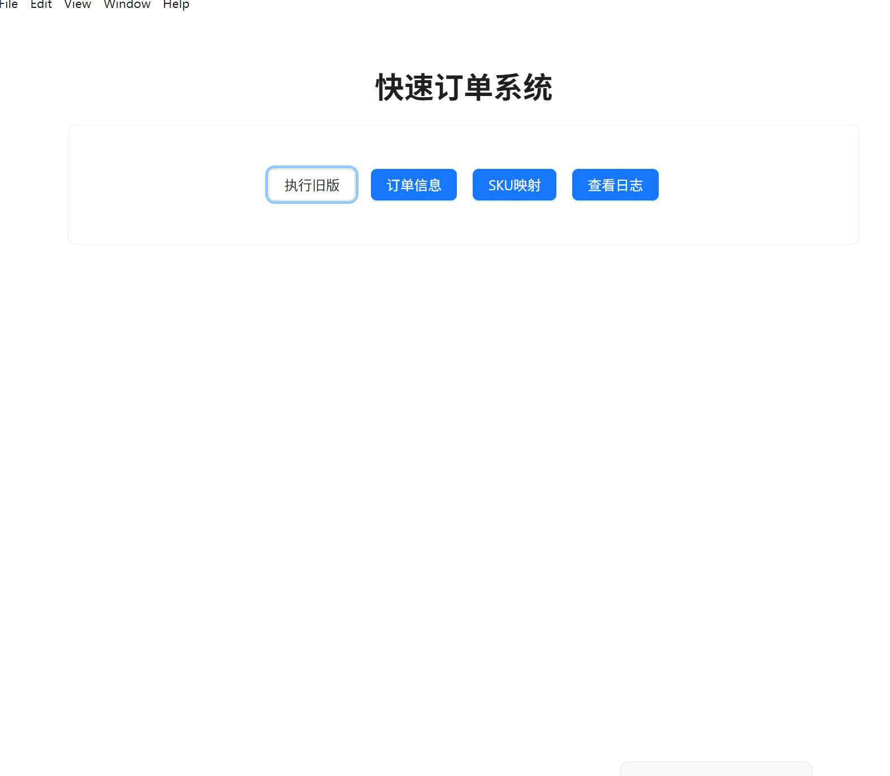
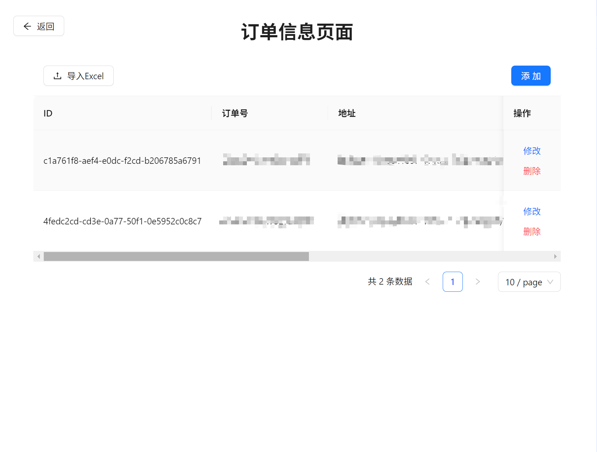
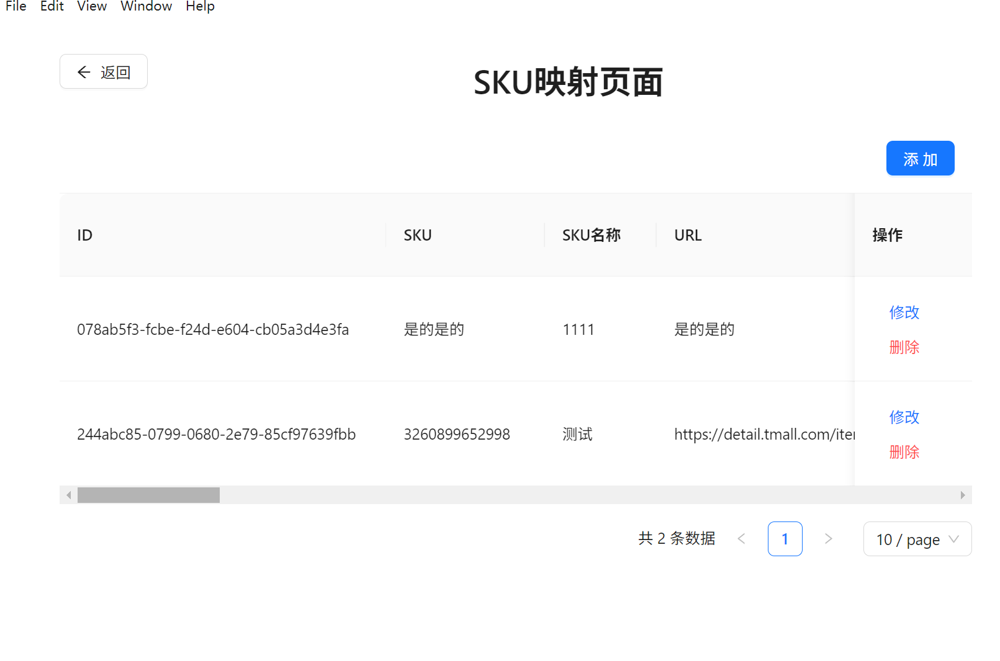
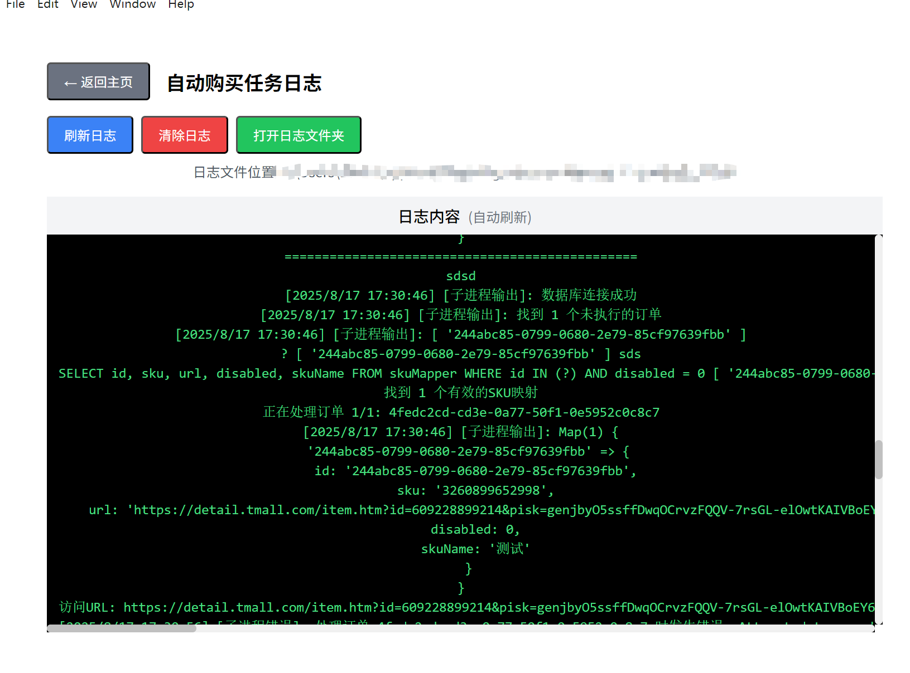

# 淘宝代拍助手 🛒

目前项目还是个demo！！请在使用的时候遵守相关法律规定

## 📖 项目简介

专为淘宝商家批量代拍设计的自动化工具！当您需要帮客户代拍商品时，不用一个一个手动下单了，批量操作省时省力 💪

主要是俺自己经常有这样的需求，手动下单太累了，所以就手搓了这个轮子 😎

**核心流程**: 淘宝商家后台导出Excel → 导入系统 → 点击一键下单 → 爬虫自动下单 → 生成未支付订单

## ⚠️ 重要提醒

> **请务必核对订单信息**：系统自动匹配可能存在误差，请在付款前仔细核对商品信息、规格、价格等，确认无误后再进行付款操作。

## 🖼️ 应用展示


**首页** - 简洁明了的操作界面，一键开始您的代拍之旅


**订单信息页面** - Excel导入后的订单数据展示，一目了然


**SKU映射页面** - 将您的商品SKU与要代拍的淘宝URL建立对应关系（这是关键步骤哦！）


**日志页面** - 如果爬虫运行出了小问题，来这里看看具体什么情况

## 🚀 快速开始

```bash
# 安装依赖
pnpm install

# 开发运行
pnpm run dev

# 打包应用
pnpm run build
```

## 🎮 使用流程

1. **导出Excel** 📊 - 从淘宝商家后台导出需要代拍的订单Excel文件
2. **导入订单** 📋 - 在"订单信息"页面导入Excel数据，系统会自动解析
3. **配置映射** 🔗 - 在"SKU映射"页面设置您的商品SKU与淘宝商品URL的对应关系
4. **一键下单** 🚀 - 点击"一键下单"按钮，坐等爬虫自动生成淘宝未支付订单
5. **客户核对** ✅ - 客户检查订单信息无误后进行付款

> 💡 **小贴士**: 第一次使用建议先用少量订单测试一下流程，熟悉后再批量操作哦！

## 🎯 适用场景

- **淘宝代发货商家**: 需要帮客户代拍商品的商家
- **批量下单需求**: 需要同时下多个订单的场景  
- **代购服务**: 提供代购服务的个人或团队

## 🛠️ 技术栈

- **前端**: React 18 + TypeScript + Ant Design
- **桌面**: Electron 33 + Vite
- **数据**: SQLite3 数据库
- **自动化**: Puppeteer 浏览器控制

## 🤖 AI开发记录

本项目的完整开发过程都有详细记录，想看AI是怎么帮忙写代码的吗？

📋 **开发日志位置**: [`.cursor/log/2025-08-17.md`](./.cursor/log/2025-08-17.md)

包含了数个开发问题的完整记录：
- 模块系统兼容性问题的解决
- 数据库集成改造过程  
- 自动化功能优化细节
- 构建打包配置调试
- 日志系统从零实现

> 💡 这些日志真实记录了AI辅助开发的全过程，包括踩过的坑、解决思路和技术选择，对学习AI编程很有参考价值！

## ⚖️ 免责声明

本工具仅供学习和技术研究使用，请遵守淘宝平台相关规定。使用本工具产生的任何后果由使用者自行承担。

---

⭐ **AI编程 × 电商自动化** - 觉得有用的话，给个星星鼓励一下吧！ 
